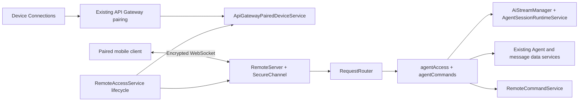

# LAN Agent remote access

The desktop owns Agent configuration, conversations, execution, approvals, and
history. Devices paired through **Settings → Device Connections** can also use
all desktop Agents, including sending messages, cancelling turns, and responding
to tool approvals. Pairing is the authorization; there is no additional Agent
grant, second device token, or separate remote-access settings page.

This implementation covers the PC endpoint. It does not implement a mobile
client, ordinary chat assistants, background-task management, file uploads, Agent
configuration edits, network discovery, tunnels, relays, or a standalone server.

## Ownership and dependency direction



`RemoteAccessService` follows `ApiGatewayService.isLanServing()` and its change
event; it never re-derives LAN state from the gateway's preferences. Enabling device connections starts an encrypted Agent
listener on an OS-assigned port on `0.0.0.0`; disabling device connections or the
gateway disconnects clients and refuses pending admissions. There is no separate
Agent listener toggle or port preference. Listener failure does not invalidate
pairing or prevent configuration export.

`src/main/services/remoteAccess/` owns framing, device authentication, RPC routing,
and subscriptions. `agentAccess.ts` (authorization and reads) and `agentCommands.ts`
(receipt-backed writes) adapt into existing Agent services. Transport
and crypto modules do not import Electron, AI, or database services. The AI/data
layers do not import remote access.

Existing AI services support observing canonical snapshots, committing a message
reservation in a caller-owned synchronous transaction, and conditionally
cancelling an execution under the existing topic lock. Already admitted Agent
work continues independently of the phone connection.

## Existing pairing and connection discovery

Continue using the existing `cherry-studio-pair` QR and `POST /pair` flow described
in the [API Gateway guide](../api-gateway/README.md#mobile-pairing-protocol).
Its `cs-dt-…` device token authorizes both provider export and Agent access. The
QR retains its existing fields and adds optional `remoteAgent` connection data:

```json
{
  "v": 1,
  "t": "cherry-studio-pair",
  "name": "Desktop",
  "port": 34444,
  "ips": ["192.168.1.12"],
  "code": "<existing single-use pairing code>",
  "remoteAgent": {
    "protocolVersion": 1,
    "instanceId": "<desktop UUID>",
    "port": 34445,
    "path": "/remote/v1/connect",
    "serverPublicKey": "<canonical base64, 32 bytes>"
  }
}
```

A client can refresh these connection fields using `GET /v1/remote-agent` on the
existing gateway. The endpoint is unauthenticated because the descriptor holds no
secrets; clients must **not** send the device token to it, since that request
crosses the LAN in plaintext. An unavailable Agent listener returns `503`. The
endpoint is hidden from OpenAPI and returns `Cache-Control: no-store`.

The device token still crosses the LAN in plaintext in the `POST /pair` response
and on every `GET /v1/export/providers` request. A LAN observer who captures it
can authenticate to the Agent listener as that device: the encrypted channel
authenticates the desktop to the client, not the client's possession of a key.

Both plaintext routes are confined to LAN peers (private, link-local, or CGNAT
addresses; see the [gateway LAN guard](../api-gateway/README.md#lan-exposure-is-confined-to-paired-device-capabilities)),
so the token is not served through a same-machine tunnel or a port forward.

Build `ws://<reachable desktop IPv4>:<remoteAgent.port><remoteAgent.path>`.
The OS-assigned port can change after restart or backup suspension; refresh the
descriptor before reconnecting. The desktop identity remains stable across port
changes. Pin its identity and public key from the QR when available. Older paired
clients bootstrap that pin through the existing trusted-LAN HTTP connection;
this inherits the existing pairing channel's network trust, not an additional
secure identity-verification step. Once pinned, never replace the identity from
an unauthenticated WebSocket hello or silently accept a changed key.

| State | Owner / storage |
|---|---|
| Device connections enabled and LAN running | `ApiGatewayService.isLanServing()` (gateway preferences + live LAN listener) |
| Device name, platform, token digest | Existing SQLite `api_gateway_paired_device`, unchanged schema |
| Desktop secret key and instance ID | Electron `safeStorage`, `Credentials/remote-access/identity.bin` |
| Command input digest and original receipt | SQLite `remote_command`, cascading from its paired device |
| Session keys and subscriptions | Memory only |
| Conversations, messages, tool decisions | Existing Agent tables and runtime |

The credential directory is outside the data backup payload. Linux's insecure
`basic_text` storage backend is rejected. Mobile clients retain their existing
device token and desktop pin in OS secure storage.

Deleting a device through the existing device list revokes both capabilities and
closes its Agent connection. Every request, snapshot, and business write rechecks
that the paired-device row still exists. All current and future Agents are
available to a paired device. Agent responses omit provider credentials/internal
resume tokens, but the same device remains authorized for provider export through
the existing API and conversation content itself may contain secrets.

`RemoteAccessService` registers as an Agent ingress with `AgentLifecycleService`,
so backup and restore pause and drain it together with channel ingress, before
the normal runtime quiescence. Restore clears paired-device rows and their command receipts
in the staged database so old tokens cannot revive revoked access or replay
commands against rolled-back receipts; users pair again using the same Device
Connections flow. A committed
restore keeps the Agent listener suspended until restart. Failed staging leaves
the live device records intact and resumes the listener.

## WebSocket connection and authenticated encryption

Only `/remote/v1/connect` supports WebSocket upgrade. Ordinary HTTP requests
return `404`; there is no HTTP business API for this feature. The Host header must
match the socket’s local IPv4 address and port. Origin must be absent or exactly
`http://IPv4:port` for that same address. This permits native clients including React Native Android's
default Origin, while rejecting unrelated browser origins. Origin is an admission
filter, not device authentication.

The design follows Orca's QR-pinned desktop identity and application-layer
encryption approach. The Cherry v1 wire contract below is its own protocol and
is not interoperable with Orca. It uses TweetNaCl's Curve25519/XSalsa20-Poly1305
primitives and Node's HKDF-SHA-256. No business payload is sent before encrypted
authentication. This channel authenticates content and counters; IP addresses,
traffic sizes/timing, hello keys, and nonces remain visible. Because the desktop
uses a static DH key, this version does **not** provide forward secrecy after
compromise of that key. It is a LAN feature, not a claim of public-server hardening.

### Handshake

All base64 cryptographic fields below use canonical padded RFC 4648 base64, not
base64url. Base64url is used only for opaque pairing secrets and device tokens.

1. Client generates a Curve25519 key pair and 32 cryptographically random nonce
   bytes. Send a **text** WebSocket message:

   ```json
   {"type":"hello","version":1,"publicKey":"<client key base64>","nonce":"<client nonce base64>"}
   ```

2. Desktop rejects malformed and low-order client keys and sends a **text** reply:

   ```json
   {"type":"ready","version":1,"instanceId":"<UUID>","publicKey":"<desktop key base64>","nonce":"<fresh server nonce base64>"}
   ```

3. Client verifies its pinned desktop key and instance ID and derives keys below.
   Desktop sends a **binary encrypted** confirmation, server counter `0`:

   ```json
   {"type":"confirm","transcriptHash":"<SHA-256 transcript, base64>"}
   ```

4. After verifying confirmation, send encrypted authentication at client counter
   `0` using the existing device token:

   ```json
   {"type":"auth","mode":"device","transcriptHash":"<base64>","token":"cs-dt-…"}
   ```

5. Desktop looks up that token in `api_gateway_paired_device` and replies with
   encrypted `{"type":"authenticated","deviceId":"...","expiresAt":1789639000000}`
   at server counter `1`. No new token is issued. Business requests start at client
   counter `1`. The device ID comes from the existing row, so command receipts
   remain associated with the same pairing across reconnects.

Use fresh client keys and a fresh nonce for every connection.
Malformed frames, cryptographic failures, authentication failures, or a handshake
exceeding ten seconds terminate the connection without a plaintext error body.

### Key derivation

`UTF8`, byte concatenation `||`, and zero-based, end-exclusive slices are used:

```text
T = UTF8(JSON.stringify([
  "cherry-remote/v1", instanceId, serverPublicKeyBase64,
  clientPublicKeyBase64, clientNonceBase64, serverNonceBase64
]))
H = SHA256(T)
S = nacl.box.before(peerPublicKey, ownSecretKey)
salt = SHA256(UTF8("cherry-remote/v1/salt\0") || clientNonce || serverNonce)
info = UTF8("cherry-remote/v1/session\0") || H
K = HKDF-SHA256(ikm=S, salt=salt, info=info, length=96)
clientToServerKey = K[0:32]
serverToClientKey = K[32:64]
sessionId = K[64:96]
```

`\0` denotes one zero byte, and JSON has no spaces. `nacl.box.before` is the
NaCl precomputed box key, **not raw X25519 output**; a mobile implementation must
use the equivalent NaCl box precomputation (Curve25519 followed by HSalsa20).

### Binary frame

Every post-hello/ready WebSocket message is one complete binary frame:

```text
frame = nonce[24] || nacl.secretbox(header[41] || UTF8(JSON), nonce, directionKey)

nonce:
  bytes  0..11  sessionId[0:12]
  byte      12  version = 1
  byte      13  direction: 0 client→desktop, 1 desktop→client
  bytes 14..15  zero
  bytes 16..23  unsigned 64-bit counter, big-endian

header (inside authenticated ciphertext):
  bytes  0..31  full sessionId
  byte      32  direction
  bytes 33..40  same counter, big-endian
```

`secretbox` output includes the 16-byte authenticator. Total overhead is 81 bytes.
Each direction has an independent counter starting at zero; all auth messages,
responses, and events consume it. Require the exact next counter and expected
nonce/header. Duplicates, skips, reflected frames, wrong sessions, invalid UTF-8,
and counters beyond uint64 cause disconnect. Serialize concurrent sends through
one ordered writer. Maximum encrypted message size is 1 MiB. Compression is off.

## Business RPC contract

Requests, responses, and events below are plaintext examples of encrypted payloads.
Request IDs are unique per connection (1–128 characters); command IDs are UUIDs
and persist across reconnects. Unknown fields are rejected in request/parameter
objects. Response and event payloads should tolerate additive fields.

```json
{"type":"request","requestId":"r1","method":"agents.list","params":{"limit":20}}
```

```json
{"type":"response","requestId":"r1","result":{"items":[],"nextCursor":null}}
```

```json
{"type":"response","requestId":"r1","error":{"code":"FORBIDDEN","retryable":false}}
```

| Method | Parameters | Result |
|---|---|---|
| `system.info` | `{}` | `instanceId`, `protocolVersion`, `capabilities` |
| `agents.list` | `cursor?`, `limit?` | `{items, nextCursor}` of `{id,name,description,runtime,availability}` |
| `workspaces.list` | `cursor?`, `limit?` | `{items, nextCursor}` of user workspaces `{id,name,path,type:"user"}` |
| `sessions.list` | `agentId`, page fields | `{items, nextCursor?}` |
| `sessions.create` | `agentId`, `commandId`, `workspaceId?` | `{status:"accepted",sessionId}` in the selected user workspace, or a new system workspace when omitted |
| `sessions.get` | `sessionId` | Current session snapshot |
| `messages.list` | `sessionId`, page fields | `{items, nextCursor?}` of lightweight history messages |
| `messages.parts.list` | `sessionId`, `messageId`, page fields | `{items:[{partIndex,type,fields,...}],nextCursor}` of detail descriptors, without content |
| `messages.parts.get` | `sessionId`, `messageId`, `partIndex`, `field`, content page fields | One requested content page |
| `artifacts.read` | `sessionId`, `messageId`, `partIndex`, `artifactIndex?`, `offset?`, `limitBytes?`, `revision?` | One explicitly requested binary artifact chunk |
| `messages.send` | `sessionId`, `commandId`, `parts:[{type:"text",text}]` | Admission receipt with `sessionId`, `userMessageId`, and `assistantMessageId` if accepted |
| `commands.get` | `commandId` | This device's stored admission/action receipt |
| `session.subscribe` | `sessionId` | `{subscriptionId}` followed by snapshot events |
| `unsubscribe` | `subscriptionId` | `{unsubscribed:true}` |
| `turns.cancel` | `sessionId`, `commandId`, `expectedExecutionId` | `{status:"cancelled"\|"execution-changed",executionId}` |
| `interactions.list` | `sessionId` | `{items:[{interactionId,anchorId?,toolCallId,toolName,canRespond}]}` without tool input |
| `interactions.get` | `sessionId`, `interactionId`, content page fields | One page of the pending interaction's JSON input |
| `interactions.respond` | `sessionId`, `commandId`, `interactionId`, `response:{approved,reason?,updatedInput?}` | `{status:"applied"\|"resolved",interactionId}` |

Page limits default to 20 and range from 1 to 50. Treat cursors as opaque; an
absent or null next cursor ends pagination. Omitting the request cursor starts at the first page. Session
ordering follows the desktop's pinned/session ordering. Message pages are
newest-first; render them in chronological order by reversing pages as needed.
Agent pagination uses an offset into the desktop’s current pinned/Agent ordering and
workspace pagination uses the desktop's user-workspace ordering. Neither is a stable
database snapshot during edits. Refresh from the first page.

Session summaries contain `id`, `agentId`, `name`, `workspaceId`,
`workspace:{id,name,path,type}`, `lastActivityAt`, `createdAt`, and `updatedAt`.
The same summary is used in `sessions.list`, `sessions.get`, and subscription
snapshots. `workspace.type` is `user` or `system`; `path` is the desktop's absolute
workspace path for display, not a mobile filesystem path. Session/message dates
use existing ISO strings;
pairing-code and connection expiry use Unix milliseconds. Agent availability
`configured` only means a model is selected, not that its runtime is healthy.

`system.info.capabilities` includes `workspaces` when workspace selection is
supported. `workspaces.list` exposes the existing user-managed workspaces, shared
across Agents; per-session system workspaces are excluded. Pass a returned `id`
as `sessions.create.workspaceId`. Omitting it retains automatic creation of an
isolated system workspace. Unknown IDs or IDs belonging to system workspaces
return `RESOURCE_UNAVAILABLE` without creating a session or command receipt.
The selected workspace is part of the command input: reusing a `commandId` with
a different workspace returns `COMMAND_CONFLICT`.

```json
{"type":"request","requestId":"r2","method":"sessions.create","params":{"agentId":"<agent ID>","workspaceId":"<ID from workspaces.list>","commandId":"<UUID>"}}
```

Text sends allow 1–8 nonempty parts and at most 64 KiB of combined UTF-8 text.

### Default synchronization and explicit detail reads

Both history pages and live snapshots use the same lightweight projection. A
message has `{id,role,parts,truncated,detailsAvailable}`; history additionally has
`status`, `createdAt`, and `updatedAt`. `partIndex` refers to the zero-based index
in the original message, not the index in this filtered projection.

| Content | Default history / subscription | Explicit detail read |
|---|---|---|
| Output and reasoning | `{type:"text"\|"reasoning",partIndex,text,totalBytes,truncated}` | `field:"text"` returns the complete content in pages |
| Markdown code fences | Preserved inside text | Same text field |
| Dedicated code part | `{type:"code",partIndex,language,text,totalBytes,truncated}` | `field:"text"` |
| Tool calls and results | Omitted, including input/output previews | List descriptors, then request `input`, `output`, or `error` |
| Final deliverables declared by `report_artifacts` | `{type:"artifact",partIndex,artifactIndex,name}` | `field:"artifacts"` returns declaration metadata (paths, descriptions, summary) |
| File parts | `{type:"artifact",partIndex,name,mediaType}` | `field:"artifact"` returns name, media type, and source |
| Conversation errors | `{type:"error",partIndex,code}` | `field:"error"` returns name, code, and message, without stack/internal metadata |
| Pending approvals / questions | Interaction identifiers, tool name, and `canRespond` | `interactions.get` returns the original input |

Artifact markers do not contain file bytes, data URLs, remote download URLs, or
local file paths. Message detail queries expose the recorded declaration; file
content requires a separate, explicit `artifacts.read` request. Ordinary text
and code remain conversation content. Provider metadata and unsupported internal
part types are never serialized through a generic raw-part endpoint.

A message projection has a 64 KiB text budget and at most 128 visible parts;
ordinary tool calls do not consume either allowance. When both output and
reasoning exist, output/code have three quarters of the text budget and reasoning
one quarter. Newer parts receive space first, keeping an earlier long reasoning
or tool sequence from starving the final answer. The returned parts still follow
their original order. Omitted/shortened visible content sets `truncated:true`;
history pages shrink below 512 KiB. Clients should offer an explicit expansion
action for truncated content or available details. They must not automatically
fetch every tool detail in response to a snapshot.

`messages.parts.list` returns bounded descriptors including their supported
`fields`; tool descriptors also include name/state. Use it to find omitted or
older parts. `messages.parts.get` accepts `field` from `text`, `input`, `output`,
`error`, `artifact`, or `artifacts`; unsupported fields return `NOT_FOUND`.
Active messages read the live accumulator; terminal messages read durable history.
Every detail request rechecks the pairing and scopes
message lookup to that session.

Content page parameters are `offset?` (UTF-8 byte offset, default `0`),
`limitBytes?` (4–32,768 bytes, default 16,384), and `revision?` (SHA-256 hex).
Responses contain `{encoding:"text"|"json",text,offset,totalBytes,nextOffset,
revision}` plus the requested part/field or interaction ID. Pages end at complete
UTF-8 character boundaries. Concatenate `text` in page order; for `encoding:"json"`,
parse only after the final page. `nextOffset:null` marks completion. A nonzero
offset requires the first page's revision. Changed content returns
`CONTENT_CHANGED`; restart at offset zero after the content settles rather than
combining different revisions. No server-side copy of detail content is retained.

For example, explicitly expanding one tool result uses:

```json
{"type":"request","requestId":"detail-1","method":"messages.parts.get","params":{"sessionId":"...","messageId":"...","partIndex":3,"field":"output","limitBytes":16384}}
```

Interaction inputs are runtime input objects, not executable JSON schemas. At
most 32 pending interaction markers are exposed at once. Fetch and display the
complete input with `interactions.get` before offering approval or collecting an
answer. This also supports large inputs without pushing them to every subscriber.
An unanchored persisted interaction has `canRespond:false` and must be handled on
PC. A resolved interaction returns `NOT_FOUND` from the detail endpoint: refresh
the markers instead of submitting a stale answer. The server resolves the
approval anchor itself; clients cannot supply one. `updatedInput`, if used, is an
object understood by the runtime, including `AskUserQuestion` answers; reason is
at most 4,096 characters. The existing runtime approval rules still determine which interactions can be answered.

### Artifact preview and download

When the user opens a marker, call `artifacts.read` with its session, message,
`partIndex`, and `artifactIndex` (default `0`). Clients cannot supply a filesystem
path, URL, or FileEntry ID. The desktop resolves the marker from the authorized
message on every request:

- `report_artifacts` declarations and unregistered `file:` parts must resolve to
  regular files inside the session workspace, including after symlink resolution.
- Managed file parts use the FileManager path for the entry already associated
  with that message. A symlink escaping that file's stored parent is rejected.
- Inline `data:` file parts are decoded only for this explicit request.
- Arbitrary HTTP(S) downloads, directories, missing files, and out-of-workspace
  declarations return `ARTIFACT_UNAVAILABLE`. The marker can still be displayed.

`offset` is a byte offset, default `0`. `limitBytes` defaults to 65,536 and is
limited to 1–262,144. The response is:

```json
{"partIndex":3,"artifactIndex":0,"name":"report.pdf","mediaType":"application/pdf","encoding":"base64","data":"<this chunk only>","offset":0,"totalBytes":120000,"nextOffset":65536,"revision":"<opaque version>"}
```

Decode each base64 chunk independently and append its bytes. For text previews,
decode the assembled bytes or use a streaming text decoder; file chunk boundaries
can split UTF-8 characters. An empty file returns empty `data` and
`nextOffset:null`. Pass the first chunk's `revision` with every subsequent offset.
Local-file revisions represent the canonical path and observed filesystem
size/timestamps; inline-file revisions hash the bytes. These are consistency
tokens, not a retained immutable file snapshot. A changed observed version
returns `CONTENT_CHANGED`; restart the download instead of mixing versions.

The client drives each chunk request and can stop a preview/download by requesting
no more chunks. Reconnect can continue at an offset only with the original version
and renewed authorization. There is no download worker, retained whole-file copy,
extra HTTP port, or automatic artifact fetch. Existing connection request and
buffer limits apply; request sequential chunks and respect `RATE_LIMITED`.

### Command receipts and execution ownership

For every user action, generate and durably remember one `commandId` and its
original method/parameters before sending. A retry uses that same command ID and
unchanged parameters, but a new connection-local `requestId`. Reusing a command
ID with changed parameters produces `COMMAND_CONFLICT`. Never automatically
invent a new command ID after an uncertain response.

`sessions.create` and `messages.send` commit the receipt and business rows in the
same SQLite transaction. Concurrent duplicate submissions cannot create a second
user row or start a second turn. Busy sessions use the existing Agent follow-up
queue and return `status:"queued"`; idle ones return `status:"accepted"`.
These statuses mean **admitted**, not completed. `commands.get` and duplicate
`messages.send` requests return the stored admission receipt, without tracking
per-input execution outcomes. An accepted receipt contains `assistantMessageId`;
a queued receipt has no reply ID and is not updated when the queue advances.
Read session snapshots and message history for current state and completed replies.

Receipts survive desktop restarts and remain historical admission records. A
queued receipt does not prove the input is still queued or will execute after a
restart. This feature adds no execution/task metadata to existing messages and
no restart reconciliation for those fields. Reusing a command ID never launches
the input again; another execution requires a new, explicit user action.

Turn cancellation and approval record `processing` before calling
the runtime, then settle the receipt. If the desktop crashes between those steps, the old-process
receipt reads as `interrupted`. The client must refresh state before another
explicit user action. Same-process in-flight actions can return `processing`.
An admitted write whose activation fails reads as `interrupted`, not a safe retry
with a new ID. Receipt tombstones survive session deletion; no automatic expiry
permits an old command to execute again. Receipts are removed only together with
their paired device: a deleted device's ID never authenticates again, so those
receipts could no longer be read or replayed.

`expectedExecutionId` comes from a current snapshot and includes the desktop
process epoch, attempt, and assistant-message anchor. It is opaque. Matching and
cancellation happen under the existing topic lock, preventing a stale stop button
from cancelling a newer turn. Approval IDs must belong to the authorized session;
already resolved approvals cannot execute twice. Disconnecting a device alone
never cancels an already admitted turn.

### Snapshot subscriptions and reconnect

```json
{
  "type":"event", "event":"session.snapshot",
  "subscriptionId":"<UUID>", "subscriptionEpoch":"<UUID>", "eventSeq":1,
  "sessionId":"<session>",
  "data":{
    "session":{"id":"<session>","agentId":"<agent>","name":"..."},
    "processEpoch":"<UUID>", "status":"streaming",
    "executions":[{"executionId":"<opaque>","messageId":"<assistant>","message":{"id":"<assistant>","role":"assistant","parts":[],"truncated":false}}],
    "interactions":[]
  }
}
```

Subscription creation schedules an initial snapshot after the subscribe response.
Changes coalesce at 50 ms. Each event fully replaces that subscription's **live
execution overlay and pending interactions**, not the entire conversation history.
It reads the main process's canonical accumulated message; clients do not assemble
raw SDK deltas. Multiple live messages share the 64 KiB content budget. Changes
that only affect omitted tool internals do not emit an identical snapshot; the
subscription compares the lightweight projection before sending. Background
tasks continue under the existing PC runtime, but this remote contract does not
expose their task lists, controls, or detached-output notifications.

`eventSeq` starts at 1 and increases for each emitted snapshot, not for each model
token. `subscriptionEpoch` changes with each new subscription; IDs/epochs never
survive reconnect. There is no retained token log or `lastEventSeq` replay API.
Subscribe to the same session twice on one connection returns the existing ID.

Statuses are `idle`, `pending`, `streaming`, `awaiting-approval`, `done`, `error`,
`aborted`, or `finalizing`. During `finalizing`, terminal persistence is still
settling. Once terminal/idle arrives, refresh history and merge by message ID.
History is the durable authority; live messages may disappear after the desktop's
stream retention window. On reconnect:

1. Complete a fresh encrypted handshake and device authentication.
2. Call `system.info`, refresh Agent/session lists as needed, and subscribe again.
3. Read `messages.list` from the latest page and overlay new snapshots by message
   ID. Refresh history on terminal events and after sends. The subscription does
   not replace history queries or announce every idle history edit.
4. Resolve uncertain actions via `commands.get` (or resend the same command ID and
   parameters). `NOT_FOUND` permits retrying that original command, not blind
   replacement with a new one.

### Limits and errors

The listener allows 32 HTTP sockets, 16 WebSockets before authentication, and 8
authenticated devices. A new authenticated connection replaces the old connection
for that same device. Each connection permits 4 subscriptions, 8 concurrent
ordinary RPCs and 2 control RPCs (cancel/respond). Rate allowance is a burst of 30
requests, replenishing 2 per second. Upgrade attempts are limited to 30/minute per
source address. After 8,192 request IDs, reconnect with fresh cryptographic state.

The server sends ping every 20 seconds, disconnects after 60 seconds without pong,
and expires a connection after one hour or ten minutes without application traffic.
Heartbeat-only traffic does not extend idle expiry. Expiry checks run on the
20-second sweep. A 4 MiB outbound buffer cap disconnects a slow client; reconnect
and resubscribe to recover. Rate-limit/frame/auth violations may close the socket;
RPC concurrency overload returns `RATE_LIMITED` with `retryable:true`.

RPC errors include `INVALID_REQUEST`, `METHOD_NOT_FOUND`, `FORBIDDEN`, `NOT_FOUND`,
`RESOURCE_UNAVAILABLE`, `RESOURCE_BUSY`, `AGENT_UNAVAILABLE`, `COMMAND_CONFLICT`,
`COMMAND_INTERRUPTED`, `INTERACTION_UNSUPPORTED`, `SUBSCRIPTION_LIMIT`,
`RATE_LIMITED`, `CONTENT_CHANGED`, `ARTIFACT_UNAVAILABLE`, and `INTERNAL_ERROR`. RPC error bodies omit raw exception messages,
filesystem paths, and credentials. `retryable` concerns request admission;
uncertain mutations still require the command-ID recovery rules above.

## Validation and references

Contract test sources cover tampering/replay/reflection, client key derivation,
existing-pairing reuse, revocation, command conflict, and transaction rollback.
Workspace test sources cover user-workspace pagination, selected/default workspace
creation, session workspace metadata, invalid selections, and idempotent retries.
Projection test sources additionally cover final-answer preservation, omitted tool
payloads, artifact markers, explicit error reads, and UTF-8 content pagination.
Artifact test sources cover binary chunk reconstruction, changed-file rejection,
workspace traversal/symlink rejection, empty files, and revoked-device download denial.
Tests, builds, and UI/device verification are user-owned and were not run for this
implementation. Static checks do not establish cross-device interoperability or
constitute a cryptographic audit. Before shipping the mobile client, validate
both directions against these byte layouts and exercise reconnect/approval races.

Primary implementation references:

- [Orca pairing](https://github.com/stablyai/orca/blob/25dd70e6118b152cd87c9786cfb54e321bfe13c9/src/main/runtime/runtime-rpc/runtime-rpc-pairing.ts),
  [Orca key schedule](https://github.com/stablyai/orca/blob/25dd70e6118b152cd87c9786cfb54e321bfe13c9/src/main/runtime/rpc/mobile-e2ee-v2-key-schedule.ts),
  and [Orca framing](https://github.com/stablyai/orca/blob/25dd70e6118b152cd87c9786cfb54e321bfe13c9/src/shared/mobile-e2ee-v2-framing.ts).
- [TweetNaCl API](https://github.com/dchest/tweetnacl-js#documentation).
- [Electron safeStorage](https://www.electronjs.org/docs/latest/api/safe-storage).
- [React Native Android WebSocket Origin](https://github.com/facebook/react-native/blob/main/packages/react-native/ReactAndroid/src/main/java/com/facebook/react/modules/websocket/WebSocketModule.kt).
